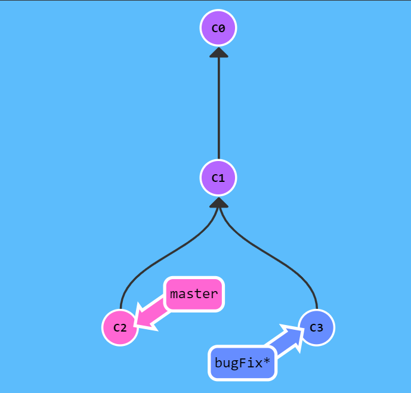
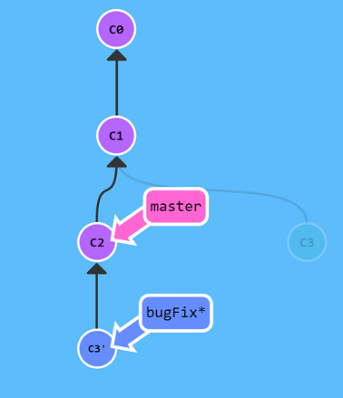
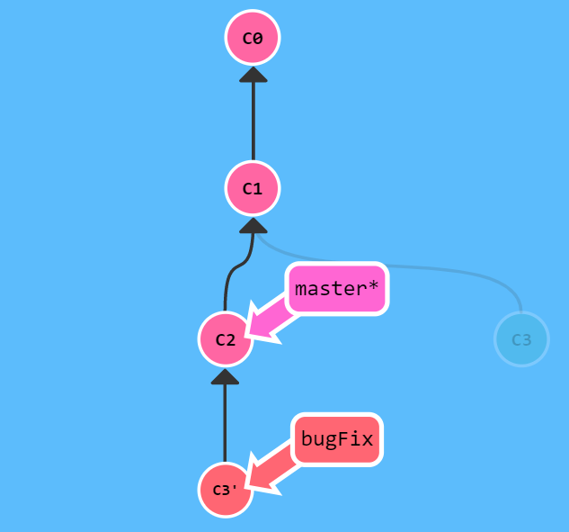
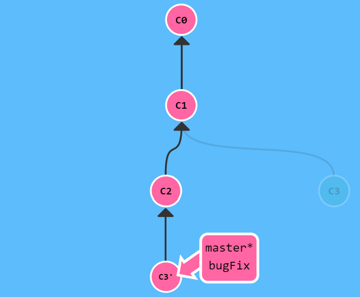

# Memo-GIT


## References

- [Tuto didactique](https://learngitbranching.js.org/?locale=fr_FR)

- [Article developpez](https://loic-guibert.developpez.com/tutoriels/git/get-started/)

- [Article atlassian](https://www.atlassian.com/git/tutorials/setting-up-a-repository)

- [Bonne pratique : Gitflow](https://www.atlassian.com/fr/git/tutorials/comparing-workflows/gitflow-workflow)

- [Résoudre votre problème](https://ohshitgit.com/fr)

- [Fiche avec toutes les commandes utiles](https://rogerdudler.github.io/git-guide/index.fr.html)


## Client Git

https://www.gitkraken.com/git-client

## Configurer git

Activer la couleur dans Git

`git config --global color.diff auto`

`git config --global color.status auto`

`git config --global color.branch auto`

`git config --global user.name "votre_pseudo"`

`git config --global user.email moi@email.com`

`vim ~/.gitconfig`

`git config --list --show-origin`


## Initialiser git

`git init`


## Indexer

Indexer les modifications qui ont été faites dans les fichiers du répertoire de travail :

* `git add -A` : Stages Everything
* `git add -u` : Stages only Modified Files
* `git add .` : Stages everything, without Deleted Files

Depuis Git 2.0, `git add .` enregistre aussi les fichiers supprimés.


## Capturer un instantané


Capturer un instantané avec directement le message :

`git commit -m "Initial commit" `


Afficher l’état du répertoire de travail et la zone de transit :

`git status`


## Modification du dernier commit

`git commit --amend`

Permet de modifier le commit le + récent.

Permet de combiner les changements stagés avec l'ancien commit au lieu de créer un commit totalement nouveau.

Peut être utilisé pour modifier le message de commit sans changer son instantané.

La modif. ne se contente pas de changer le dernier commit : elle le remplace totalement


## Comparaisons

Comparaison des changements :

```
mkdir diff_test_repo
cd diff_test_repo
touch diff_test.txt
echo "this is a git diff test example" > diff_test.txt
git init .

git add diff_test.txt
git commit -am "add diff test file"

echo "this is a diff example" > diff_test.txt

git diff

git diff --color-words
```

## Les branches

Lister les branches existantes en local :

`git branch`

Lister les branches distantes :

`git branch -r`

Lister les branches locales + distantes :

`git branch -a`


Créer une nouvelle branche  :

`git checkout -b my-branch-name`


Detruit la branche spécifiée :

`git branch -d nom_branche`

Renomme 1 branche courante :

`git branch –m old-name new-name`


Comparaison de 2 ou n branches : 
```
git diff branch1..other-feature-branch
git diff branch1 branch2
```

Comparaison de fichiers entre 2 branches

git diff master new_branch ./diff_test.txt


## git checkout

`git checkout nom_branche`

Permet la navigation entre les branches

Faire un git checkout sur une branche mets à jour le repertoire et dit à Git de sauver tous les commit de la branche.


## Git Merge

https://www.atlassian.com/git/tutorials/using-branches/git-merge

Faire un 'merge' avec Git crée un commit spécial qui a deux parents.

1/ On se positionne sur la branche qui va recevoir le Merge

`git checkout nom_branche`

Ex: `git checkout master`


2/ Recuperer les dernier commits distants

Execute `git fetch` pour rapatrier les derniers commits récents. 

4/ `git pull`

5/ Merging

`git merge nom_branche` 

=> nom_branche est le nom de la branche qui va etre mergé dans la branche de reception.


Exemple 1 de Merge :

```
# Start a new feature
git checkout -b new-feature master
# Edit some files
git add <file>
git commit -m "Start a feature"
# Edit some files
git add <file>
git commit -m "Finish a feature"
# Merge in the new-feature branch
git checkout master
git merge new-feature
git branch -d new-feature
```


Exemple 2 de Merge :

Demarre une nouvelle branche et passe sur cette nouvelle branche
```
git checkout -b new-feature master
# Edit some files
git add <file>
git commit -m "Start a feature"
# Edit some files
git add <file>
git commit -m "Finish a feature"
# Develop the master branch
git checkout master
# Edit some files
git add <file>
git commit -m "Make some super-stable changes to master"
# Merge in the new-feature branch
git merge new-feature
git branch -d new-feature
```

## Les conflits de Merge

```
$ mkdir git-merge-test
$ cd git-merge-test
$ git init .
$ echo "this is some content to mess with" > merge.txt
$ git add merge.txt
$ git commit -am "we are commiting the inital content"

$ git checkout -b new_branch_to_merge_later
$ echo "totally different content to merge later" > merge.txt
$ git commit -am"edited the content of merge.txt to cause a conflict"
```
```
git checkout master
Switched to branch 'master'
echo "content to append" >> merge.txt
git commit -am "appended content to merge.txt"
[master 24fbe3c] appended content to merge.tx
1 file changed, 1 insertion(+)
```

```
$ git merge new_branch_to_merge_later
Auto-merging merge.txt
CONFLICT (content): Merge conflict in merge.txt
Automatic merge failed; fix conflicts and then commit the result.
```

```
$ git status
On branch master
You have unmerged paths.
(fix conflicts and run "git commit")
(use "git merge --abort" to abort the merge)

Unmerged paths:
(use "git add <file>..." to mark resolution)

both modified:   merge.txt
```


```
$ cat merge.txt
<<<<<<< HEAD
this is some content to mess with
content to append
=======
totally different content to merge later
>>>>>>> new_branch_to_merge_later
```

## Résoudre le conflit manuellement

1/ Je modifie merge.txt

2/ git add merge.txt

3/ git commit -m "merged and resolved the conflict in merge.txt"

[master 93ae695] merged and resolved the conflict in merge.txt


## Résoudre le conflit par outils

git status => aide a identifier les fichiers en conflits

git log --merge  => 1 liste de commits en conflit entre de branches de merge.

git diff => Trouve les differences entre fichiers en conflit.

git checkout => changer de branches ou annuler les modifs en cours sur un fichier.

git reset --mixed    => utilisé pour annuler des changements apportés au répertoire de travail et à la zone de staging.


## Outils quand les conflits arrivent durant un merge

git merge --abort     => quittera le processus de fusion et ramènera la branche à l'état avant le début de la fusion.

git reset    => réinitialiser les fichiers en conflit à un état fonctionnel connu


## La technique du rebase

La seconde façon de combiner les contenus de deux branches est rebase.

Rebase prend un ensemble de commits, les "recopie", et les ajoute en bout de chaîne à un autre endroit.

Transférer notre travail de la branche 'bugFix' directement sur le travail existant dans 'master' :

`git rebase master`

 deviens : 


Désormais, le travail de la branche 'bugFix' est juste en haut de la branche 'master' et nous avons une belle séquence linéaire de commits.

Notez que le commit C3 existe toujours quelque part (il est en grisé sur l'arbre), et C3' est la "copie" que nous avons créée sur master avec rebase.

Le seul problème est que master n'a pas été mis à jour, faisons cela maintenant…

Nous sommes désormais positionnés sur la branche master. Continuons en faisant le rebase sur bugFix… Et voilà ! Puisque master était un ascendant de bugFix, git a simplement déplacé la référence de la branche master en avant dans le temps.

`git rebase bugFix`

 deviens : 


## Workflow de branche de fonctionnalité Git

https://www.atlassian.com/fr/git/tutorials/comparing-workflows/feature-branch-workflow

```
Push an existing folder
cd existing_folder
git init
git remote add origin git@gitlab.com:bxxx.xxxx.com/my-app.git
git add .
git commit -m "Initial commit"
git push -u origin master
```

Commencez par la branche master.


git checkout master

git fetch origin                 ==> récupère tout ajout qui a été poussé vers ce dépôt depuis que vous l’avez cloné ou la dernière fois que vous avez récupéré les ajouts

git reset --hard origin/master   ==>  jetez tous mes changements locaux, oubliez tout sur ma branche locale actuelle et mettez tous comme sur la branche master du depot distant.


Créer une nouvelle branche (et se positionner dessus)

git checkout -b post-model


Mettez à jour, ajoutez, commitez et pushez des changements

```
git status
git add <some-file>
git commit
```


Pushez la branche de fonctionnalité vers le dépôt distant

git push -u origin post-model


Pour obtenir du feedback sur la nouvelle branche de fonctionnalité, créez une pull request dans une solution de gestion de dépôt 


Résolvez du feedback

Désormais, les membres de l'équipe commentent et approuvent les commits pushés.

Résolvez les commentaires en local, commitez, puis faites un push des changements suggérés.

Vos mises à jour apparaissent dans la pull request.


Mergez votre pull request

Avant de faire un merge, vous devrez peut-être résoudre des conflits de merge si d'autres ont apporté des changements au dépôt. Une fois votre pull request approuvée et exempte de conflit, vous pouvez ajouter votre code à la branche principale (master).

Faites un merge à partir de la pull request

```
git merge post-model
git status
git push -u origin master
```


## Scénario d'utilisation des pull requests

1. Le développeur crée la fonctionnalité dans une branche dédiée (dépôt local)

2. Il fait un push de la branche vers un dépôt public

3. Il fait une pull request via le site web du dépôt public

4. L'équipe révise le code, en discute, puis le modifie.

Le mainteneur de projet fait un merge de la fonctionnalité dans le dépôt officiel, puis ferme la pull request.


## Cas spécifique : Oublie de création d'une nouvelle branche

```
git stash

git checkout -b feature/transfert-order

git stash pop

git add .

git commit -m "Add Transfert Order features" 

git push origin feature/transfert-order
```
